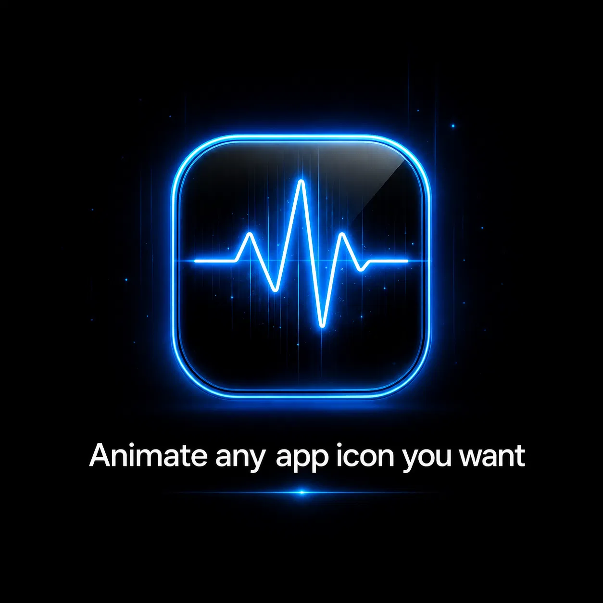

<div align="center">



# LivingIcons
### Your Home Screen, alive.

Animated icons for jailbroken iOS.  
GIFs, themes, per-app controls, live previews — built for iOS 17.

**[Website](https://dldkdkd.github.io/LivingIcons/)** · **[Add to Sileo](sileo://source/https://dldkdkd.github.io/LivingIcons/)**

<br>

&nbsp;&nbsp;
&nbsp;&nbsp;
&nbsp;&nbsp;
&nbsp;&nbsp;
&nbsp;&nbsp;


</div>

---

## What is LivingIcons?

LivingIcons replaces ordinary Home Screen icons with animated artwork.

Give one app its own GIF, install a complete animated theme, change animation speed and looping, or build your own theme from scratch. Everything is managed from a native Settings pane instead of a separate app.

Supports **GIF, APNG, PNG, JPG and JPEG** artwork.

### Highlights

- Animated Home Screen icons
- Per-app animations
- Full theme support
- Animation speed and loop controls
- Live previews in Settings
- Installed-app browser and search
- Theme importing from Files
- Custom theme creation
- Image and GIF compression
- Notification badges stay above animations
- Starter animation theme included
- Relaxin / RootHide support

---

## Preview

<div align="center">

&nbsp;
&nbsp;


</div>

---

## Install

Add the repo to Sileo:

```text
https://dldkdkd.github.io/LivingIcons/
```

Install **LivingIcons**, respring, then open:

```text
Settings → LivingIcons
```

That's it.

---

## Making a Theme

Make a folder and put your animated/static icon files inside it. Name each file after the app's **bundle identifier**.

```text
My Theme/
├── com.apple.MobileSMS.gif
├── com.apple.Preferences.gif
├── com.apple.Music.gif
└── com.apple.weather.gif
```

Import the folder from **Settings → LivingIcons → My Themes**, or manage themes manually with Filza.

Don't know the bundle IDs? Use **LivingIcons Dumper**.

---

## LivingIcons Dumper

A small companion utility for theme makers.

Install it, respring, then browse through the Home Screen pages and folders you want to capture. Dumper collects app icons and bundle identifiers so it's easy to match your theme files to the right apps.

Once you've got what you need, uninstall it.

---

## More from the repo

### LivingRespring
Choose any GIF for the iOS 17 respring animation. LivingRespring automatically prepares it into safe PNG frames for use during respring.

### DockPages
Swipe between multiple pages directly inside the iPhone dock.

- Up to five dock pages
- Up to four apps per page
- Smooth horizontal swiping
- Designed for iOS 17

> **DockPages is an alpha.** If something breaks, include your device, iOS version and Relaxin version when reporting it.

### Atria English Patch
Translates the RootHide / Relaxin build of Atria into English, including its Home Screen editor and preference resources.

---

## Compatibility

| | |
|---|---|
| **iOS** | iOS 17 |
| **Jailbreak** | Relaxin / RootHide |
| **Architecture** | arm64e |
| **Injection** | ElleKit |
| **Legacy ABI** | `oldabi` where required |

Required compatibility packages are handled through package dependencies when applicable.

---

## Add Adam's Repo

<div align="center">

```text
https://dldkdkd.github.io/LivingIcons/
```

**[Open the repo](https://dldkdkd.github.io/LivingIcons/)** · **[Add to Sileo](sileo://source/https://dldkdkd.github.io/LivingIcons/)**

</div>

---

## Bug reports

If something isn't working, include:

- Device model
- iOS version
- Relaxin version
- ElleKit version
- Package version
- Active theme, if relevant
- Screenshot or SpringBoard crash log

The more useful information in the report, the easier it is to reproduce.

---

## Support the project

LivingIcons is free. If you want to support development, there's a donation option inside **Settings → LivingIcons**.

No features are locked behind it.

---

<div align="center">


### LivingIcons
**Bring your Home Screen to life.**

Made by **Adam Never Lack**

</div>
